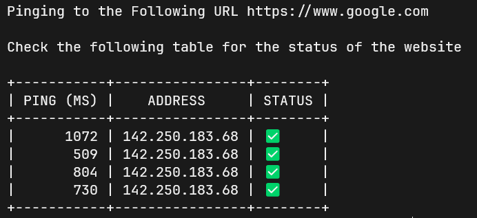
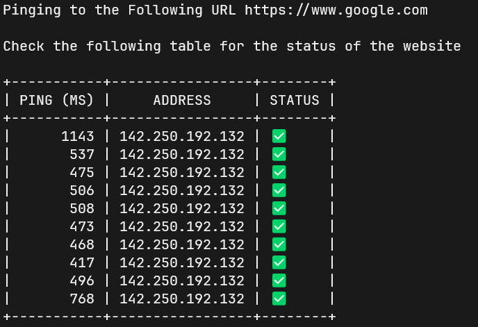

# http-status-checker

`http-status-checker` is a command-line interface (CLI) tool to check the status of a website. It can be used to check the status of a website and get the response time of the website.

## Features

- Check the status of a website.
- Measure the response time of the website.
- Ping the website multiple times and get average response time.

## Technologies Used
- Golang

## Installation

To install the `http-status-checker` tool, clone this repository and build the project:

```sh
git clone https://github.com/Hrishikesh-Panigrahi/http-status-checker
cd http-status-checker
go build .
```

## Usage

### Basic Usage

To check the status of a website:

```sh
./http-status-checker check [url]
```

### Custom Ping Count

To ping a website a specific number of times:

```sh
./http-status-checker check [url] [pings]
```

### Help Command

To display the help message:

```sh
./http-status-checker --help
```

## Docker Usage

You can also run the tool using Docker. To do this, pull the Docker image and run it:

### Pulling the Docker Image

```sh
docker pull hrishikeshpanigrahi025/http-status-checker
```

### Running the Docker Container

To check the status of a website with a specific number of pings:

```sh
docker run hrishikeshpanigrahi025/http-status-checker check www.google.com 2
```

## Examples

### Checking Status with Default Pings

If you don't specify the number of pings, it will default to 4 pings:

```sh
./http-status-checker check www.google.com
```


### Checking Status with Custom Ping Count

Specify the number of pings:

```sh
./http-status-checker check www.google.com 10
```


### Displaying Help

```sh
./http-status-checker --help
```

## Flags

--help: Show help for the hsc command.
